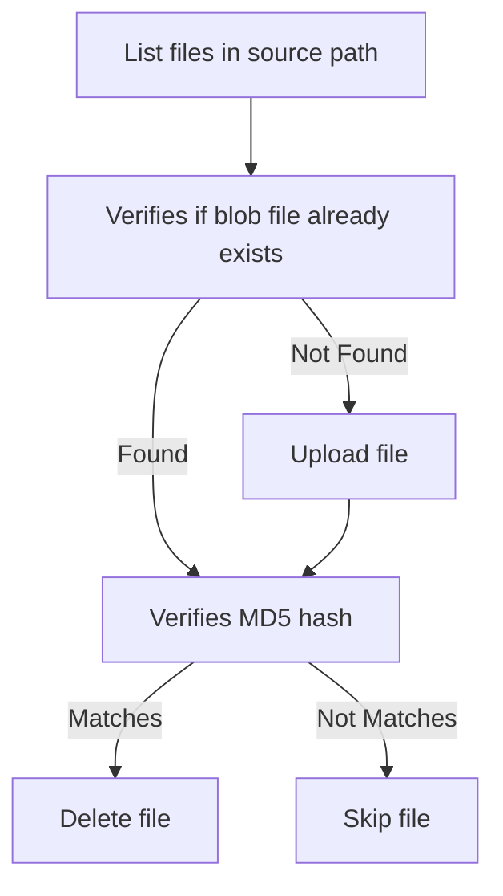

I recently needed a seamless and efficient way to recursively archive and move local files to Azure Blob Storage with relative folder structure intact. That’s why I wrote Blobify, a .NET global tool that simplifies the process of transferring files from a local directory to an Azure Blob Storage container.

## Easy Installation with .NET SDK CLI

Blobify is installed using the .NET SDK CLI. Ensure you have the .NET 8 SDK installed, and type the following command:

```bash
dotnet tool install -g Blobify
```

## Simple and Powerful Command Line Options

Utilizing Blobify is straightforward with its archive command and options.

### Usage

```bash
blobify archive <inputpath> <azureStorageAccount> <azureStorageAccountContainer> [OPTIONS]
```

#### Example

```bash
blobify archive c:\local\folder targetaccount targetcontainer
```

##### Arguments

```text
    <inputpath>                       Input path
    <azureStorageAccount>             Azure Storage Account Name
    <azureStorageAccountContainer>    Azure Storage Account Container Name
```

##### Options

```text
    -h, --help               Prints help information
        --azure-tenant-id    Azure Tentant ID to sign into
        --file-pattern       Local file pattern to match (default **/*.*)
```

## Secure Authentication and Reliable Uploads

Blobify ensures secure authentication using Azure EntraID and Azure.Identity's [DefaultAzureCredential](https://learn.microsoft.com/en-us/dotnet/api/azure.identity.defaultazurecredential?view=azure-dotnet) . It uploads files from the specified source folder—and optionally a file pattern, and removes them locally only after verifying that a file with the same hash exists in the target blob storage container. If the file already exists on blob it won't upload it, but if hashes macthes it'll remove the local file.



## Example Usage in an Azure DevOps Pipeline task

My personal use case was to archive local files on a schedules, this was achived with a scheduled Azure DevOps Pipelines running on a local DevOps agent, example Azure Pipelines task:

```yaml
    - task: AzureCLI@2
      displayName: Archive files
      inputs:
        azureSubscription: 'azureSubscription'
        scriptType: bash
        scriptLocation: inlineScript
        inlineScript: |
          dotnet tool restore
          dotnet blobify archive c:\local\agent\folder account container
```

The above task expects Blobify to be installed and pinned to a specific verion using a .NET tool manifest in repository, a manifest can be created using the .NET SDK CLI

```bash
dotnet new tool-manifest
dotnet tool install Blobify
```


## Open Source and Free to Use

Blobify is available for free on NuGet and is open source, with its code accessible on GitHub. It is licensed under the permissive MIT license.


- NuGet Package: [Blobify on NuGet](https://www.nuget.org/packages/Blobify/)
- GitHub Repository: [Blobify on GitHub](https://github.com/devlead/Blobify)