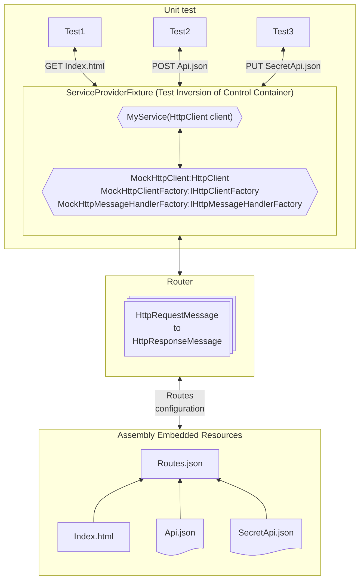

There are undoubtedly many sophisticated and comprehensive solutions out there for mocking HTTP requests in .NET applications. However, I found myself with a very specific need: I wanted a lightweight, low-friction way to mock third-party HTTP APIs within my unit tests, without a lot of ceremony or complexity. I needed something that was "good enough" for my use case, providing in-memory request/response simulation that would let me validate my HTTP client interactions.

That's why I created Devlead.Testing.MockHttp. It's not trying to be the most feature-complete or elegant solution; it simply aims to solve this specific testing scenario in a straightforward way, with a minimum of ceremony, mimicking how the tested code would be used in a real application. If you have similar needs for basic HTTP mocking in your unit tests, this might be useful for you too.

Even though it has a fairly limited scope, it still enables testing of a wide range of scenarios, i.e., validating request headers, status codes, authentication, and even a small state machine for testing retry logic/throttling and requiring certain requests to be made before others.

## Overview diagram



## Dependency injection in unit tests?

My goal was to ensure that the unit test for constructing fixtures and object code closely resembles how they are used in real applications. For instance, if resolving your HTTP client is simply done with `AddHttpClient<MyService>()` in the application, then that should be all that's needed for it to be resolved in tests. By using an IOC container to resolve the services, it ensures that the same logic to construct the services is used in the tests as in the application. It also makes tests more resilient to changes in the service construction logic, especially if you use common extension methods to configure the services.

Let's walk through an example of that.

### Example Service

The service is a simple class that uses an `HttpClient` to fetch data from a couple of different endpoints.

```csharp
public class MyService(HttpClient httpClient)
{
    public async Task<string> GetData()
    {
        var response = await httpClient.GetAsync("https://example.com/index.txt");
        return await response.Content.ReadAsStringAsync();
    }

    public async Task<User?> GetSecret()
    {
        return await httpClient.GetFromJsonAsync<User>("https://example.com/login/secret.json");
    }
}
```

### Example Unit Test

The unit tests below are NUnit tests that verify the behavior of the `MyService` class using `Devlead.Testing.MockHttp.Tests` provided `ServiceProviderFixture` to resolve the service. Methods are called as usual, and the results are snapshotted using [Verify](https://github.com/VerifyTests/Verify). Any exceptions or changes in the response are asserted and will fail the test.

```csharp
public class MyServiceTests
{
    [Test]
    public async Task GetData()
    {
        // Given
        var myService = ServiceProviderFixture.GetRequiredService<MyService>();

        // When
        var result = await myService.GetData();

        // Then
        await Verify(result);
    }

    [Test]
    public async Task GetUnauthorizedSecret()
    {
        // Given
        var myService = ServiceProviderFixture.GetRequiredService<MyService>();

        // When 
        var result = Assert.CatchAsync<HttpRequestException>(myService.GetSecret);

        // Then
        await Verify(result);
    }

    [Test]
    public async Task GetSecret()
    {
        // Given
        var myService = ServiceProviderFixture.GetRequiredService<MyService>(
                            configure => configure.ConfigureMockHttpClient<Constants>(
                                            client => client.DefaultRequestHeaders.Authorization = new System.Net.Http.Headers.AuthenticationHeaderValue(
                                                "Bearer",
                                                "AccessToken"
                                                )
                                        )
                            );

        // When
        var result = await myService.GetSecret();

        // Then
        await Verify(result);
    }
}
```

### Registering the service

The project provides a `ServiceProviderFixture` partial class, which contains IOC helpers and a partial method `InitServiceProvider` for you to implement to register your own registrations and any of their dependencies. In theory, your project could have multiple mocked routes within the same project, and `.AddMockHttpClient<Constants>()` below picks up the routes from the assembly embedded resources relative to the type parameter `Constants`.

```csharp
public static partial class ServiceProviderFixture
{
    static partial void InitServiceProvider(IServiceCollection services)
    {
        services.AddHttpClient<MyService>()
                .AddMockHttpClient<Constants>();
    }
}
```

Services and instances registered in the `InitServiceProvider` method will be available for all unit tests and can be resolved using the `ServiceProviderFixture.GetRequiredService<T>()` method, as shown in the example unit test above. You can also register instances/services for a specific test or even configure the registrations using a delegate, as shown in the `GetSecret` test.

`GetRequiredService` can resolve up to seven different types by passing one to seven type arguments, and each call to `GetRequiredService` will create a new separate isolated IOC container instance, ensuring that each test can have its own isolated dependencies.

```csharp
var myService = ServiceProviderFixture
                    .GetRequiredService<MyService>();

var (
        myService,
        myService2
    ) = ServiceProviderFixture
            .GetRequiredService<MyService, MyService2>();

...

var (
        myService,
        myService2,
        myService3,
        myService4,
        myService5,
        myService6,
        myService7
    ) = ServiceProviderFixture
            .GetRequiredService<MyService, MyService2, MyService3, MyService4, MyService5, MyService6, MyService7>();
```

This makes it easy to resolve multiple services in a single test or even resolve the same service multiple times with different configurations.

For example, resolving a `TimeProvider` for testing date/time-related functionality and your service that uses it.

```csharp
// Given
var (
        timeProvider,
        myService
    ) = ServiceProviderFixture
            .GetRequiredService<FakeTimeProvider, MyService>();

// When
var result = myService.GetData();
var cachedResult = myService.GetData();
timeProvider.Advance(TimeSpan.FromDays(1));
var uncachedResult = myService.GetData();

// Then
await Verify(
    new {
        result,
        cachedResult,
        uncachedResult
    }
);
```

### Registering routes

Routes are configured using the `Routes.json` file, which is embedded as an assembly resource. The file is used to configure the `Router`, which is responsible for matching incoming requests to the correct response. The file is placed in a "Routes" folder relative to the type parameter used in `.AddMockHttpClient<T>()`.

The example routes file below provides two endpoints available via GET requests. The secret endpoint requires an access token in the Authorization header, while the index endpoint does not.

```json
[
  {
    "Request": {
      "Methods": [
        {
          "Method": "GET"
        }
      ],
      "AbsoluteUri": "https://example.com/login/secret.json"
    },
    "Responses": [
      {
        "RequestHeaders": {},
        "ContentResource": "Example.Login.Secret.json",
        "ContentType": "application/json",
        "ContentHeaders": {},
        "StatusCode": 200
      }
    ],
    "Authorization": {
      "Authorization": [
        "Bearer AccessToken"
      ]
    }
  },
  {
    "Request": {
      "Methods": [
        {
          "Method": "GET"
        }
      ],
      "AbsoluteUri": "https://example.com/index.txt"
    },
    "Responses": [
      {
        "RequestHeaders": {},
        "ContentResource": "Example.Index.txt",
        "ContentType": "text/plain",
        "ContentHeaders": {},
        "StatusCode": 200
      }
    ]
  }
]
```

The `Router` will match the request to the correct response based on the request method and absolute URI. If the request doesn't match any of the routes, a 404 Not Found response is returned. If authentication is required, the `Authorization` section is used to validate the request headers against the configured values, and a 401 Unauthorized response is returned if it doesn't match.

### Route content

The content of the response is fetched from the assembly embedded resources, which is configured using the `ContentResource` property. The content is read as a stream and converted to the appropriate content type. This means that the content can be a JSON file, a text file, an image, or even a binary file. The files specified in `ContentResource` are relative to the `Routes.json` file, i.e., the above configuration would have a folder structure like this:

```
Constants.cs
Resources/Routes.json
Resources/Example/Index.txt
Resources/Example/Login/Secret.json
```

As with any embedded resource, directory separators are normalized to `.` in the `ContentResource` path. For example, `Example/Login/Secret.json` above would be `Example.Login.Secret.json` in the `Routes.json` file.

In your `.csproj`, it would be configured something like this:

```xml
<ItemGroup>
    <None Remove="Resources\Example\index.txt" />
    <None Remove="Resources\Example\Login\Secret.json" />
    <None Remove="Resources\Routes.json" />
</ItemGroup>

<ItemGroup>
    <EmbeddedResource Include="Resources\Example\Index.txt" />
    <EmbeddedResource Include="Resources\Routes.json" />
    <EmbeddedResource Include="Resources\Example\Login\Secret.json" />
</ItemGroup>
```

## Advanced scenarios

### State machine

Routes can be configured to require certain requests to be made before others. This is done by setting the request to disabled:

```json
...
    "Request": {
      "Methods": [
        {
          "Method": "HEAD"
        }
      ],
      "AbsoluteUri": "https://azurestorageaccount.blob.core.windows.net/AzureStorageAccountContainer/NewFile.json",
      "Disabled": true
    },
...
```

In another route response, configure it to enable the above request using the `EnableRequests` property:

```json
...
    "Request": {
      "Methods": [
        {
          "Method": "PUT"
        }
      ],
      "AbsoluteUri": "https://azurestorageaccount.blob.core.windows.net/AzureStorageAccountContainer/NewFile.json"
    },
    "Responses": [
      {
        "RequestHeaders": {},
        "ContentType": "application/json",
        "ContentResource": "Commands.ArchiveCommandTests.NewFiles.NewFile.json",
        "StatusCode": 201,
        "EnableRequests": [
          {
            "Method": "HEAD",
            "AbsoluteUri": "https://azurestorageaccount.blob.core.windows.net/AzureStorageAccountContainer/NewFile.json"
          }
        ]
      }
    ],
...
```

So, the HEAD request will result in a 404 Not Found response, but the PUT request will result in a 201 Created response, and the HEAD request will be enabled.

### Throttling

Throttling can be configured by calling the `SimulateRetryAfter` extension while registering your services.

```csharp
// Given
var (httpClient, timeProvider) = ServiceProviderFixture
                                .GetRequiredService<HttpClient, FakeTimeProvider>(
                                    services => services.SimulateRetryAfter<Constants>(
                                        rateLimitOccurrenceCount: rateLimitOccurrenceCount,
                                        retryAfterInterval: TimeSpan.FromMinutes(1)
                                    )
                                );
TimeSpan timeAdvance = TimeSpan.FromMinutes(timeMinutesAdvance);
var responses = new List<HttpResponseMessage>();

// When
for (int i = 0; i <= rateLimitOccurrenceCount * 2; i++, timeProvider.Advance(timeAdvance))
{
    responses.Add(await httpClient.GetAsync("https://example.com/index.txt"));
}

// Then
await Verify(responses);
```

The above example will simulate a rate limit by advancing the time and checking the response status code. `rateLimitOccurrenceCount` is the number of requests that will be allowed before the rate limit is applied, and `retryAfterInterval` is for how long the rate limit will be applied once it occurs.

### Request headers

Request headers can be configured to validate the request headers against the configured values, and different responses can be configured based on the request headers.

```json
...
  {
    "Request": {
      "Methods": [
        {
          "Method": "PUT"
        }
      ],
      "AbsoluteUri": "https://azurestorageaccount.blob.core.windows.net/AzureStorageAccountContainer/NewFile.json"
    },
    "Responses": [
      {
        "RequestHeaders": {
          "Content-Type": [ "application/json" ],
          "Content-Length": [ "9" ],
          "x-ms-blob-type": [ "BlockBlob" ],
          "Content-MD5": [ "uasiD3l1Rg7NApFvCBOV1Q==" ]
        },
        "ContentType": "application/json",
        "ContentResource": "Commands.ArchiveCommandTests.NewFiles.NewFile.json",
        "ContentHeaders": {},
        "StatusCode": 201
      }
    ],
    "Authorization": {
      "Authorization": [
        "Bearer AccessToken"
      ]
    }
  },
...
```

In the above example, a 201 Created response is returned for PUT requests to the storage account blob container, but the request headers are validated against the configured values.

### MD5 checksum

The Content-MD5 header is calculated and returned for all content responses.

## Getting started

The package is available on [NuGet](https://www.nuget.org/packages/Devlead.Testing.MockHttp/) and can be installed using the following command:

```
dotnet add package Devlead.Testing.MockHttp
```

The package is a source package and is supported on .NET 8 and above.

### Example projects

The package is used in the following example projects:
- [Devlead.Testing.MockHttp.Tests](https://github.com/devlead/Devlead.Testing.MockHttp/tree/main/src/Devlead.Testing.MockHttp.Tests) - contains examples of many of the features.
- [Blobify](https://github.com/devlead/Blobify) - its tests contain examples like enabling requests, request headers filtering, MD5 checksum validation, and more.

## Contributing

The project is open source, and contributions are welcome. Please feel free to submit a PR or an issue. You'll find the project on [GitHub](https://github.com/devlead/Devlead.Testing.MockHttp).

## Conclusion

I hope you find this package useful. Feel free to let me know if you have any feedback or suggestions.