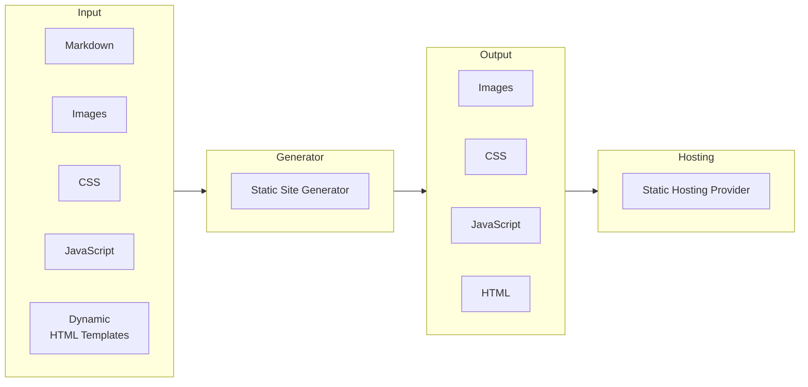
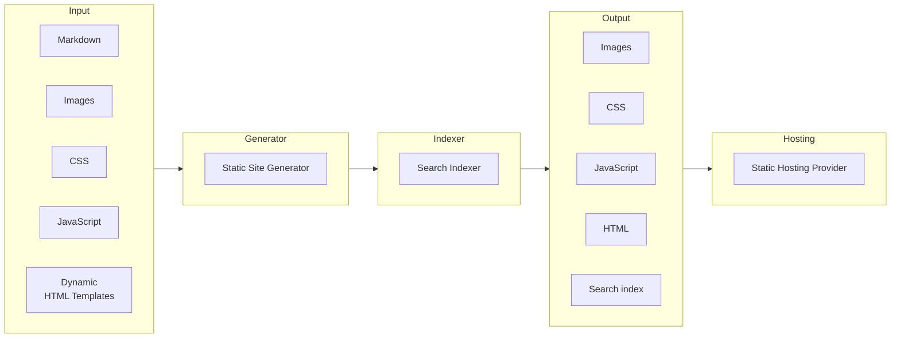

Static web apps excel at delivering pre-rendered content quickly, efficiently, and cost-effectively. 
However, implementing search functionality with these same benefits has traditionally required compromising the static nature by using a backend or third-party service for a good experience. In this post, I'll demonstrate how to add powerful client-side search to a static website using WebAssembly. For my blog, I'm using the [Statiq](https://www.statiq.dev/) as my static site generator together with GitHub Pages as my hosting provider, but the approach described should work across most static site generators and hosting platforms.

## Static web app model

At its core, static web apps follow a simple yet powerful pattern. Content (the model) typically exists as markdown documents with metadata, while templates (the view) define how that content should be presented. The static site generator acts as the orchestrator, processing this separation of concerns by applying the templates to the content. The result is pre-generated static HTML files for every possible route on the site, ready to be served efficiently to visitors without any runtime processing.



## Adding static search

In this post, we'll implement search functionality by introducing an indexing step that runs after the static site generator has completed its work but before deployment to the hosting provider. This additional step analyzes the generated content and creates a search index that gets included with the site's static assets.



## Pagefind

For this implementation, we'll use Pagefind - a powerful static search solution written in Rust. Pagefind works by analyzing your static HTML content, generating a WebAssembly-powered search index, and providing a JavaScript API for seamless integration.

### Installing

Easiest way to obtain Pagefind is via [NPM](https://www.npmjs.com/package/pagefind) (*binaries also available via its GitHub [releases](https://github.com/CloudCannon/pagefind/releases) and wrapper package through [pypi](https://pypi.org/project/pagefind/)*).

```bash
npm install -g pagefind
```

### Creating index

Pagefind has several parameters and configuration options available, but to get started you can simply point it to your static site's generated content. The basic command is:


```bash
pagefind --site "path to generated site"
```

This will create a `pagefind` folder in your site output directory containing:

- Compressed WebAssembly search indexes
- JavaScript API files
- CSS styles for the default UI components

### Adding to your site

To add the search functionality to your site, you'll need to:

1. Reference the Pagefind CSS stylesheet
2. Include the Pagefind JavaScript file
3. Add a placeholder `<div>` element where the search UI will be rendered
4. Initialize the Pagefind UI when the page loads

Here's an example of the minimal HTML code needed:


```html
<link href="/pagefind/pagefind-ui.css" rel="stylesheet">
<script src="/pagefind/pagefind-ui.js"></script>
<div id="search"></div>
<script>
    window.addEventListener('DOMContentLoaded', (event) => {
        new PagefindUI({ element: "#search", showSubResults: true });
    });
</script>
```

## Integrating with Statiq

Statiq has support for executing [External Processes](https://www.statiq.dev/guide/web/external-processes), these can be executed during

1. Initialization: The process should be started only once before other processes on the first engine execution.
1. BeforeExecution: The process should be started before each pipeline execution.
1. AfterExecution: The process should be started after all pipelines have executed.
1. BeforeDeployment: The process should be started after normal pipelines are executed and before deployment

Looking at my [Program.cs](https://github.com/devlead/devlead.se/blob/c58f61579cac0ad5700ba44440d75c69534fcca7/src/DevLead/Program.cs#L12C1-L21C6) the integration was just a matter of adding two process steps:

1. Install Pagefind during initialization
2. Execute Pagefind before deployment

```csharp
    .AddProcess(
        ProcessTiming.Initialization,
        launcher => new ProcessLauncher("npm", "install", "-g", "pagefind") { 
            ContinueOnError = true
        }
    )
    .AddProcess(
        ProcessTiming.BeforeDeployment,
         launcher => new ProcessLauncher("pagefind", "--site", $"\"{launcher.FileSystem.OutputPath.FullPath}\"")
    )
```

Then I added the CSS to my theme's [header template](https://github.com/devlead/devlead.se/blob/c58f61579cac0ad5700ba44440d75c69534fcca7/src/DevLead/input/_head.cshtml#L12)
```html
<link href="/pagefind/pagefind-ui.css" rel="stylesheet">
```

Followed by placholder div to my theme's [footer template](https://github.com/devlead/devlead.se/blob/c58f61579cac0ad5700ba44440d75c69534fcca7/src/DevLead/input/_footer.cshtml#L12) where I wanted the search UI to appear.

```html
 <div id="search"></div>
```

Finally added the pagefind script and init code to my theme's [scripts template](https://github.com/devlead/devlead.se/blob/c58f61579cac0ad5700ba44440d75c69534fcca7/src/DevLead/input/_scripts.cshtml#L2-L7)

```html
<script src="/pagefind/pagefind-ui.js"></script>
<script>
    window.addEventListener('DOMContentLoaded', (event) => {
        new PagefindUI({ element: "#search", showSubResults: true });
    });
</script>
```
And voilá, my site is indexed and searchable, even locally in preview mode🏆


## What's indexed?!

By default, Pagefind will index all content it finds in your static site, which can sometimes lead to duplicate results if you have content repeated across multiple pages (like tag pages or summaries). However, Pagefind provides several HTML attributes that give you fine-grained control over what gets indexed:

- `data-pagefind-body`: When added to an element, only content within elements with this attribute will be indexed. If used anywhere on your site, pages without this attribute are excluded entirely.

- `data-pagefind-ignore`: Add this to any element you want to exclude from indexing. This works even if the element is inside a `data-pagefind-body` section.

- `data-pagefind-index-attrs`: Allows you to specify HTML attributes to index, like image alt text or link titles.

These attributes gave me precise control over my search index. For example, to avoid duplicate results from tag pages and summaries, I added `data-pagefind-body` only to the main content of my blog posts in my [layout template](https://github.com/devlead/devlead.se/blob/c58f61579cac0ad5700ba44440d75c69534fcca7/src/DevLead/input/_layout.cshtml#L90)

```c#
 <div id="content" class="col-md-12" @(Document.GetBool("IsPost") ? "data-pagefind-body" : "") >  
 ```

## Potential gotchas

### CDN

Images in search results are HTML encoded, which worked with local images but caused issues with my CDN. Fortunately, the Pagefind JS API provides a `processResult` callback so you can post-process the search result data model before it's returned to the search result UI. I modified my [scripts template](https://github.com/devlead/devlead.se/blob/0b464f8f8abfbcdb0f478955bcefbed1f046d9c1/src/DevLead/input/_scripts.cshtml#L8-L11) in the Pagefind initialization to unencode the characters causing issues with my CDN.

```html
<script>
    window.addEventListener('DOMContentLoaded', (event) => {
        new PagefindUI({ 
            element: "#search",
            showSubResults: true,
             processResult: function (result) { 
                result.meta.image = result.meta.image.replaceAll("&amp;", "&");
                return result;
            }
        });
        
    });
</script>
```

### Compression

Pagefind compresses its index files during indexing so they can be served as-is without the need to be compressed by the HTTP server. This generally works seamlessly with hosting providers like GitHub Pages and Azure Static Web Apps. However, in some situations, depending on your configuration, you might need to either:
- Opt-out of compression for these already compressed files, or
- Add headers to indicate that they're compressed / should be served

For example, with Azure App Service, your `web.config` needs to add the MIME types and headers to indicate compression. Here's how that configuration might look:

```xml
<configuration>
  <system.webServer>
    <staticContent>
      <mimeMap fileExtension=".pf_fragment" mimeType="application/pf_fragment" />
      <mimeMap fileExtension=".pf_index" mimeType="application/pf_index" />
      <mimeMap fileExtension=".pf_meta" mimeType="application/pf_meta" />
      <mimeMap fileExtension=".pagefind" mimeType="application/pagefind" />
    </staticContent>
    <rewrite>
      <outboundRules>
        <rule name="Add gzip Content-Encoding for specific extensions">
          <match serverVariable="RESPONSE_Content-Encoding" pattern=".*" />
          <conditions logicalGrouping="MatchAny">
            <add input="{REQUEST_FILENAME}" pattern="\.pf_fragment$" />
            <add input="{REQUEST_FILENAME}" pattern="\.pf_index$" />
            <add input="{REQUEST_FILENAME}" pattern="\.pf_meta$" />
            <add input="{REQUEST_FILENAME}" pattern="\.pagefind$" />
          </conditions>
          <action type="Rewrite" value="gzip" />
        </rule>
      </outboundRules>
    </rewrite>
  </system.webServer>
</configuration>
```

 
## Conclusion

Adding search functionality to a static website no longer requires compromising its static nature. [Pagefind](https://pagefind.app) provides a straightforward solution that maintains the benefits of static sites through its WebAssembly-powered approach. With excellent [documentation](https://pagefind.app) and an active open-source [project](https://github.com/cloudcannon/pagefind), implementing powerful client-side search has never been more accessible.

By following the steps outlined in this post, you can add robust search functionality to your static site while maintaining its performance, efficiency, and cost-effectiveness.

So Pagefind is worth taking for a spin, and feel free to let me know what you think!