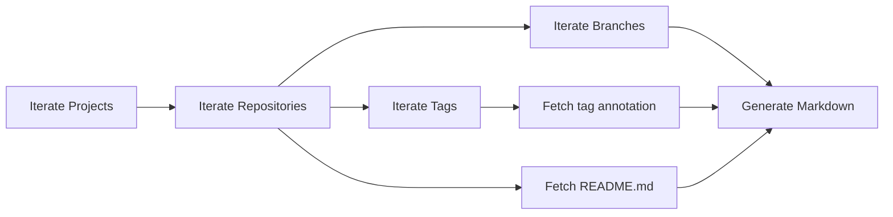

For the last couple of months, I've had the pleasure of mentoring two talented .NET students, [Andreas Siggelin](https://se.linkedin.com/in/andreassiggelin) and [Elie Bou Absi](https://se.linkedin.com/in/elie-bou-absi-5b722123a). They've been working on various internal and customer projects, gaining practical experience in real-world software development. One project we've been collaborating on is AZDOI, a tool designed to document an Azure DevOps organization. After seeing its value in our work, we've decided to open source AZDOI, and in this blog post, I'll walk you through what it is and how you can use it.

# What AZDOI Does

AZDOI (Azure DevOps Inventory) is a .NET tool designed to create documentation for Azure DevOps organizations. The tool connects to the Azure DevOps REST API and iterates over all projects in an organization it has access to, using either personal access token or Azure Entra ID authentication i.e. using a service principle.

For each project, AZDOI systematically inventories all repositories, fetching useful data including default branch, size, and URIs. It goes deeper by also collecting each repository's branches, tags, and README content. 



The output is a well-organized set of Markdown files structured at the organization, project, and repository levels. These generated Markdown files can then serve as source input for a static site generator to create comprehensive, easily navigable, searchable documentation of your entire Azure DevOps organization.

An example of the end result published to GitHub Pages can be found at [https://wcomab.github.io/AZDOI/AZDOI/](https://wcomab.github.io/AZDOI/AZDOI/)

While AZDOI currently focuses on documenting Azure Repos, future versions may expand to cover other aspects of Azure DevOps like work items, pipelines, and release definitions to provide a more complete organizational view.


## Getting Started

AZDOI is a .NET tool distributed via [NuGet.org](https://www.nuget.org/packages/AZDOI/). You can install it either as a globally available tool or as a local tool using a tool manifest.

### Global Installation

To install AZDOI as a global tool, run the following command:

```bash
dotnet tool install --global AZDOI
```

Once installed globally, you can invoke AZDOI simply by using the command:

```bash
azdoi
```

### Local Installation

If you prefer to install AZDOI locally (per repository), you can set up a tool manifest and install it with the following commands:

```bash
# Create tool manifest (only needed first time when setting up local/repo-versioned tools)
dotnet new tool-manifest

# Install tool into manifest
dotnet tool install --local AZDOI
```

After installing, make sure to commit the manifest file located at `.config/dotnet-tools.json` into your repository. This allows anyone cloning the repo or using a DevOps pipeline to restore all versioned tools by executing:

```bash
dotnet tool restore
```

As a local tool, you can invoke AZDOI using:

```bash
dotnet azdoi
```

## Usage

The basic usage of AZDOI is as follows:

```bash
azdoi inventory repositories <devopsorg> <outputpath> [OPTIONS]
```

For example:

```bash
azdoi inventory repositories AZDOI /path/to/output
```

### Options

Here are some of the available options you can use with AZDOI inventory repositories command:

| Parameter                      | Description                                         | Default Value                           |
|--------------------------------|-----------------------------------------------------|-----------------------------------------|
| `--help`                       | Used to get help with parameters                    |                                         |
| `--pat`                        | Personal Access Token for authentication            | Environment variable: AZDOI_PAT         |
| `--entra-id-auth`              | Use Entra ID for Azure DevOps Authentication        | False                                   |
| `--azure-tenant-id`            | Entra Azure Tenant ID for authentication            | Environment variable: AZURE_TENANT_ID   |
| `--include-project`            | Include specific projects                           |                                         |
| `--exclude-project`            | Exclude specific projects                           |                                         |
| `--include-repository`         | Include specific repositories                       |                                         |
| `--exclude-repository`         | Exclude specific repositories                       |                                         |
| `--include-repository-readme`  | Include specific repository README                  |                                         |
| `--exclude-repository-readme`  | Exclude specific repository README                  |                                         |
| `--run-in-parallel`            | Enable parallel processing of projects              | False                                   |

When the `--entra-id-auth` option is specified, AZDOI will attempt to authenticate using the [DefaultAzureCredential](https://learn.microsoft.com/en-us/dotnet/api/azure.identity.defaultazurecredential?view=azure-dotnet), which tries to authorize in the following order based on your environment:

1. [EnvironmentCredential](https://learn.microsoft.com/en-us/dotnet/api/azure.identity.environmentcredential?view=azure-dotnet)
2. [WorkloadIdentityCredential](https://learn.microsoft.com/en-us/dotnet/api/azure.identity.workloadidentitycredential?view=azure-dotnet)
3. [ManagedIdentityCredential](https://learn.microsoft.com/en-us/dotnet/api/azure.identity.managedidentitycredential?view=azure-dotnet)
4. [SharedTokenCacheCredential](https://learn.microsoft.com/en-us/dotnet/api/azure.identity.sharedtokencachecredential?view=azure-dotnet)
5. [VisualStudioCredential](https://learn.microsoft.com/en-us/dotnet/api/azure.identity.visualstudiocredential?view=azure-dotnet)
6. [VisualStudioCodeCredential](https://learn.microsoft.com/en-us/dotnet/api/azure.identity.visualstudiocodecredential?view=azure-dotnet)
7. [AzureCliCredential](https://learn.microsoft.com/en-us/dotnet/api/azure.identity.azureclicredential?view=azure-dotnet)
8. [AzurePowerShellCredential](https://learn.microsoft.com/en-us/dotnet/api/azure.identity.azurepowershellcredential?view=azure-dotnet)
9. [AzureDeveloperCliCredential](https://learn.microsoft.com/en-us/dotnet/api/azure.identity.azuredeveloperclicredential?view=azure-dotnet)
10. [InteractiveBrowserCredential](https://learn.microsoft.com/en-us/dotnet/api/azure.identity.interactivebrowsercredential?view=azure-dotnet)

## DevOps Pipeline

Below is a fairly minimal Azure Pipeline that runs daily to generate an inventory of Azure DevOps repositories. This pipeline uses Azure CLI authentication and uploads the results as a pipeline artifact.

```yaml
# azure-pipelines.yml
trigger:
  - main

schedules:
- cron: "0 22 * * *"
  displayName: "Daily build at 22:00"
  branches:
    include:
      - main
  always: true

pool:
  vmImage: 'ubuntu-latest'

steps:
- task: AzureCLI@2
  displayName: 'Generate Azure DevOps Inventory'
  inputs:
    azureSubscription: 'azure-devops-inventory-tool'
    scriptType: 'bash'
    scriptLocation: 'inlineScript'
    inlineScript: |
      URL="$(System.CollectionUri)"
      ORG_NAME=${URL#https://dev.azure.com/}
      ORG_NAME=${ORG_NAME%/}
      echo "Organization name is: $ORG_NAME"

      dotnet tool restore \
        && dotnet AZDOI inventory repositories $ORG_NAME "$(Build.ArtifactStagingDirectory)" --entra-id-auth --run-in-parallel \
        && echo '##vso[artifact.upload artifactname=AzureDevOpsDocs]$(Build.ArtifactStagingDirectory)'
```

### Pipeline Configuration Explanation

The Azure Pipeline configuration above does the following:

#### Trigger
- The pipeline runs automatically when changes are pushed to the `main` branch.
- It is scheduled to run daily at 22:00 (10 PM) UTC through a cron schedule.
- The schedule is set to always run, even if there are no code changes.

#### Environment
- It uses the latest version of Ubuntu as the build agent.

#### Steps
The pipeline has a single step using the Azure CLI task that:
1. Extracts the Azure DevOps organization name from the collection URI.
2. Runs the AZDOI tool to generate an inventory of repositories by:
   - Restoring .NET tools.
   - Running the `inventory repositories` command for the organization.
   - Using Entra ID (formerly Azure AD) authentication.
   - Running operations in parallel for better performance.
   - Saving output to the build artifacts directory.
3. Uploads the generated documentation as a build artifact named 'AzureDevOpsDocs'.

The pipeline requires an Azure service connection named 'azure-devops-inventory-tool' with appropriate permissions to access Azure DevOps resources.

## Conclusion

In this post, we introduced AZDOI, a .NET tool designed to document Azure DevOps organizations by generating a set of Markdown files. You can find the code for AZDOI at [GitHub](https://github.com/WCOMAB/AZDOI/), and the tool is available for installation via [NuGet](https://www.nuget.org/packages/AZDOI/). 

An example of the generated documentation can be viewed at [AZDOI Example Documentation](https://wcomab.github.io/AZDOI/AZDOI/). 

Take it for a spin, and feel free to let us know what you think!