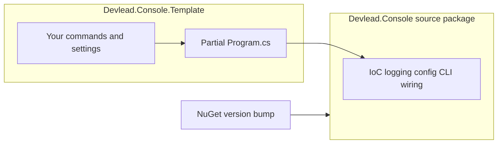

Back in 2021 I wrote about [my preferred .NET console stack](https://www.devlead.se/posts/2021/2021-01-15-my-preferred-console-stack), an opinionated alternative to `dotnet new console` built around [Spectre.Console](https://spectresystems.github.io/spectre.console/), dependency injection, and structured logging. That recipe worked well, and I've since used it as the foundation for several tools, including [ARI](https://github.com/devlead/ARI), [Blobify](https://github.com/devlead/Blobify), [DPI](https://github.com/devlead/DPI), [BRI](https://github.com/devlead/bri), and [AZDOI](https://github.com/WCOMAB/AZDOI). The original approach shipped everything as a .NET template, which was great for getting started, but over time I ran into a familiar problem: templates are excellent for scaffolding, yet not so great for keeping shared bootstrap code in sync across many applications.

This post is a follow-up on how I've evolved that stack. The template still scaffolds new projects, but the shared glue code now lives in [Devlead.Console](https://www.nuget.org/packages/Devlead.Console), a versioned source NuGet package. That combination gives you the easy onboarding of a template with the maintainability of a normal package dependency.

## Why templates alone fall short

A .NET template is distributed as a NuGet package and installed with `dotnet new install`. When you scaffold a project, you get a snapshot of whatever the template author thought was useful at that moment. That works fine the first time.

The friction shows up when you maintain more than one console application, or when the bootstrap code itself needs to evolve. If logging setup changes, Spectre.Console gets a breaking API shift, or you want to add configuration support, every project that was scaffolded from the template now has its own copy of the old glue code. You either manually merge fixes across repositories, or re-scaffold and copy your business logic back in. Neither option scales particularly well.

NuGet packages solve the opposite problem nicely. Pin a version, run `dotnet restore`, and every consumer gets the same dependency. Source packages take that a step further for glue code: the `.cs` files compile into your assembly rather than hiding behind a `lib/` reference, which keeps the copy/paste ergonomics while removing drift.

## Source packages: best of both worlds

I touched on source packages last year when introducing [Devlead.Testing.MockHttp](https://www.devlead.se/posts/2025/2025-02-16-introducing-mockhttp-testing). The same arguments apply here:

- A source package ships `.cs` files as compile-time content under `contentFiles/cs/{tfm}/...`, not as a traditional library reference.
- The code is compiled into your application assembly, so you can step through it, extend it, and reason about it like your own code.
- You extend the shared bootstrap using partial classes and partial methods in your project, without forking the package.
- Versioning, release notes, and dependency update tooling (i.e. Renovate) work the same as for any other NuGet package.

The idea is to get the copy/paste experience of inlined glue code without the copy/paste experience of fixing that same code across every project.



## Devlead.Console

[Devlead.Console](https://github.com/devlead/Devlead.Console) is the source package that contains the shared bootstrap. It keeps the same opinionated philosophy as the 2021 template:

- Dependency injection via Microsoft.Extensions
- Command-line parsing via Spectre.Console.Cli
- Logging via Microsoft.Extensions.Logging.Console
- Configuration via Microsoft.Extensions.Configuration
- Source Link via the built-in .NET SDK support (no separate package reference needed)

What changed is how you interact with it. Instead of a top-level `Program.cs` with all the wiring inlined, you implement a `partial class Program` and hook into optional partial methods:

```csharp
public partial class Program
{
    static partial void ConfigureInMemory(IDictionary<string, string?> configData)
    {
        configData.Add("TestService__Version", "1.0.0.0");
    }

    static partial void AddServices(IServiceCollection services)
    {
        services
            .AddOptions<TestServiceSettings>()
            .BindConfiguration(nameof(TestService));

        services.AddSingleton<TestService>();
    }

    static partial void ConfigureApp(AppServiceConfig appServiceConfig)
    {
        appServiceConfig
            .AddCommand<TestCommand>("test")
                .WithDescription("Example test command.")
                .WithExample(["test"]);

        appServiceConfig
            .AddBranch(
                "yolo",
                c => c.AddCommand<TestCommand>("test")
                        .WithDescription("Example test command.")
                        .WithExample(["yolo", "test"])
            );

        appServiceConfig.SetApplicationName("myapp");
    }
}
```

The partial methods cover the three places you typically need to customize:

- `ConfigureInMemory` for in-memory settings during development or testing
- `AddServices` for dependency injection registrations
- `ConfigureApp` for commands, nested branches, and the application name

The resulting CLI supports commands like `myapp test` and `myapp yolo test`. For Spectre.Console patterns around settings classes, validation attributes, and command structure, the [2021 post](https://www.devlead.se/posts/2021/2021-01-15-my-preferred-console-stack) still applies; that part of the developer experience has not changed.

If you need full control, set `UseDefaultProgram` to `false` in your project file and provide your own `Program` implementation. See the [Devlead.Console README](https://github.com/devlead/Devlead.Console/blob/develop/README.md) for details.

A typical project file references the package like any other dependency:

```xml
<ItemGroup>
  <PackageReference Include="Devlead.Console" Version="2026.6.23.767" />
</ItemGroup>
```

The package multi-targets `net8.0`, `net9.0`, and `net10.0`, so you can stay on a supported LTS or current SDK without maintaining separate bootstrap code per framework.

## Devlead.Console.Template today

[Devlead.Console.Template](https://www.nuget.org/packages/Devlead.Console.Template) has been refactored to use Devlead.Console. It still scaffolds a working console application, but now with minimal moving parts:

```bash
dotnet new install Devlead.Console.Template
dotnet new devleadconsole -n MyConsole
```

You can also pick the target framework explicitly (`net8.0`, `net9.0`, or `net10.0`, default is `net10.0`):

```bash
dotnet new devleadconsole -n MyConsole --framework net8.0
```

The template owns your application-specific code: the project file, a sample command and settings class, and the partial `Program` stubs that call into the package hooks. The package owns the bootstrap: dependency injection setup, logging, configuration, Spectre.Console wiring, and the dependency versions for the shared stack.

Compared to the [2021 folder layout](https://www.devlead.se/posts/2021/2021-01-15-my-preferred-console-stack), you still get a `Commands` folder with your command, settings, and validation code. What you no longer get is a full copy of the bootstrap `Program.cs` that silently drifts from project to project.

## Devlead.SourcePack

Packaging a source NuGet by hand means wrestling with MSBuild: `contentFiles`, `BuildAction=Compile`, per-target-framework paths, and making sure `dotnet pack` produces something consumers can actually restore. To simplify that, I created [Devlead.SourcePack](https://www.nuget.org/packages/Devlead.SourcePack), an opinionated MSBuild package for authoring source NuGet packages using the standard SDK `dotnet pack` workflow.

Devlead.Console is built with Devlead.SourcePack, as is [Devlead.Testing.MockHttp](https://www.nuget.org/packages/Devlead.Testing.MockHttp/). If you want to author your own source packages, the [Devlead.SourcePack README](https://github.com/devlead/Devlead.SourcePack) covers the properties and item types. This post stays focused on consuming the console stack rather than publishing new source packages.

## Example projects

Devlead.Console is used in several real-world tools:

- [ARI](https://github.com/devlead/ARI) - Azure Resource Inventory, documents tenant resources as markdown
- [Blobify](https://github.com/devlead/Blobify) - archives local files to Azure Blob Storage
- [BRI](https://github.com/devlead/bri) - Bicep Registry Inventory, documents modules in an Azure container registry
- [DPI](https://github.com/devlead/DPI) - Dependency Inventory, reports NuGet dependencies to Azure Log Analytics
- [AZDOI](https://github.com/WCOMAB/AZDOI) - Azure DevOps Inventory, documents an Azure DevOps organization (a community project I've had the pleasure of mentoring)
- [UnpackDacPac](https://github.com/devlead/UnpackDacPac) - unpacks SQL Server DACPAC files

Each of these started from the same opinionated bootstrap and then added domain-specific commands and services on top.

## Getting started

Install the template and scaffold a new project:

```bash
dotnet new install Devlead.Console.Template
dotnet new devleadconsole -n MyTool
```

The template includes a `PackageReference` to Devlead.Console. To update to a newer version:

```bash
dotnet add package Devlead.Console
```

From there, replace the sample command with your own, register services in `AddServices`, and wire up commands in `ConfigureApp`. The [Devlead.Console README](https://github.com/devlead/Devlead.Console/blob/develop/README.md) has the full API reference.

## Conclusion

My console stack still boils down to the same ingredients: Spectre.Console for CLI parsing, Microsoft.Extensions for DI, logging, and configuration. What changed is where the shared wiring lives. The template scaffolds; the source package maintains. That split keeps the happy path from 2021 while making it practical to evolve the bootstrap across many tools without drift.

Feel free to let me know if you've got your own recipe for console applications, or if you try this approach and have feedback.

## References

- [Devlead.Console](https://github.com/devlead/Devlead.Console) ([NuGet](https://www.nuget.org/packages/Devlead.Console))
- [Devlead.Console.Template](https://github.com/devlead/Devlead.Console.Template) ([NuGet](https://www.nuget.org/packages/Devlead.Console.Template))
- [Devlead.SourcePack](https://github.com/devlead/Devlead.SourcePack) ([NuGet](https://www.nuget.org/packages/Devlead.SourcePack))
- [My preferred .NET console stack (2021)](https://www.devlead.se/posts/2021/2021-01-15-my-preferred-console-stack)
- [Introducing Devlead.Testing.MockHttp (2025)](https://www.devlead.se/posts/2025/2025-02-16-introducing-mockhttp-testing)
- [Spectre.Console](https://spectresystems.github.io/spectre.console/) ([NuGet](https://www.nuget.org/packages/Spectre.Console))
- [Spectre.Console.Cli](https://www.nuget.org/packages/Spectre.Console.Cli) ([NuGet](https://www.nuget.org/packages/Spectre.Console.Cli))
