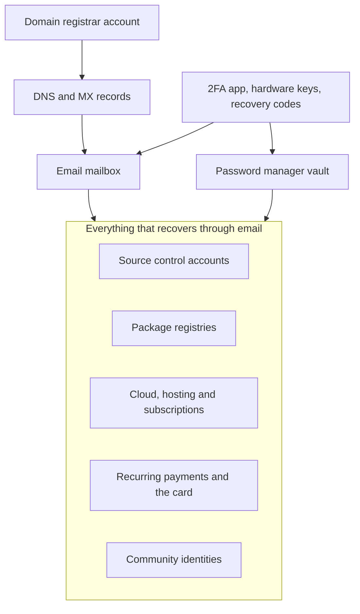

A couple of years ago I sat at a close friend's kitchen table together with his wife. He was gone. We spent hours trying to make sense of what he'd left behind online: domains, virtual private servers, source repositories, online accounts, subscriptions, decades of accumulated technologist debris. Most of it made no sense to her, and honestly, plenty of it didn't make much sense to me either. We were grieving, crying and laughing at the same time, while trying to put a lifetime of digital footprint into some kind of order.

That evening, plus a few other events around the same time, got me thinking. I live in what I jokingly call a mixed marriage, geek and normal, and I never want to leave my wife or my kids in that position. So this post is about the exercise I've been doing since: taking inventory of my digital life and deciding up front what should happen to it. I talked about that same exercise with Carl Franklin and Richard Campbell on [.NET Rocks - Episode 2022](https://www.dotnetrocks.com/details/2022), and the episode coming out today is what finally took this from draft to public.

## Why this is practical rather than morbid

For the foreseeable future the earth will keep spinning whether I'm here or not. The only open question is what I hand over.

As a Swede, feelings and emotions can be hard to talk about, but we're very good at being practical. So make this a practical exercise rather than an emotional one. We even have a word for the analog version, *döstädning*, death cleaning, the habit of clearing out your things while you still can so nobody else has to guess later. This is the same thing applied to your digital life, and as with the original, most of the value is in the cleaning and not in the dying.

It's also not only about death. It's equally about a hospital stay, burnout, a bad accident, or three weeks somewhere without signal. And I'm not unique here. There are countless developers, IT pros, makers and open source maintainers with families who don't live at the same level of geekery.

A caveat before the how. This is my highly subjective personal point of view, arrived at through one evening that shook me and a couple of years of chewing on it afterwards. It isn't a standard, and it certainly isn't legal advice. Your assets, your family and your jurisdiction all differ from mine, so take what follows as inspiration rather than a checklist to copy, keep the parts that fit and work out what actually works for you. I'd expect plenty of people to land somewhere different, and that's entirely as it should be.

And a second, lighter warning, of the here be dragons variety. This is written by a geek, so there are tables ahead, along with bulleted lists and at least one directed graph. Sorting things into rows and boxes is how I process them, which is more or less the thesis of this whole post, so I won't apologize for it. ❤️

## A digital bill of materials

What I ended up with is best described as a digital bill of materials for a life spent online. Not a legal document first, an inventory first, because you can't hand over what you've never listed.

Six questions to ask yourself:

1. What should die with me, and what should live on?
2. Who needs access to what?
3. Which domains are actually valuable?
4. What happens to the open source projects I maintain?
5. Have I identified successors where that makes sense?
6. Where are the credentials, and who can get to them when needed?

## Five categories for every asset

Sorting each asset into one of five buckets is the part I've found genuinely useful, because it turns a vague sense of unease into a decision per item.

| Category                 | Meaning                                                                        |
|--------------------------|--------------------------------------------------------------------------------|
| **Personal ownership**   | Projects I want to remain under my control for as long as I'm breathing.       |
| **Emergency succession** | Projects someone else can take over if I'm temporarily incapacitated.          |
| **Temporary delegation** | Projects I'm happy for someone else to maintain while I'm away or on vacation. |
| **Open succession**      | Projects I'm happy for someone else to take over at any time.                  |
| **Personal legacy**      | Projects I want to remain tied to me and *not* be transferred to someone else. |

 

Personal legacy is the category people forget. Not everything deserves a handover, and pushing a project onto someone out of a vague sense of duty isn't a favor to anyone. Sometimes the right answer is a graceful archive and a README that says "this is done".

## What to inventory

The list below is roughly the order in which things break when nobody's looking after them:

- Domains and DNS registrars, by far the most common point of silent failure.
- Virtual private servers, cloud subscriptions, hosting, storage.
- Source control accounts and organizations.
- Package registries, i.e. NuGet, npm, PyPI, Docker Hub, and marketplace extensions.
- Code signing certificates and keys.
- Two-factor authentication, i.e. authenticator apps, hardware keys, and recovery codes.
- Email, the root account that can reset almost everything else.
- Recurring payments and the card they're on. What breaks when that card expires?
- Community identities, i.e. blogs, YouTube, podcasts, and Discord or Slack ownership.
- The physical layer, i.e. the NAS, the home lab, the backups, and the drawer of drives. If you need somewhere to put the contents of that drawer, [Blobify](https://www.devlead.se/posts/2024/2024-09-05-introducing-blobify) is what I use to archive local folders to Azure Blob Storage.

That order isn't arbitrary. Most of the list only stays reachable because something above it still works, and the shape of that is worth seeing before you decide who gets what.

Three things gate almost everything else, the mailbox, the vault and the second factor. And one thing gates the mailbox, which is why domains and registrars sit at the top of that list rather than the bottom.

Package registries deserve a special mention. When I wrote about [a quarter of a billion NuGet downloads](https://www.devlead.se/posts/2026/2026-03-22-quarter-billion-nuget-downloads) I called the number vanity, and it is, but the responsibility behind it isn't. Every one of those downloads is someone depending on a package that has exactly one owner listed somewhere.

There's also a security dimension that goes well beyond continuity. A package account that nobody is watching is a supply chain problem waiting to happen. If those credentials end up in the wrong hands, whoever holds them can push a new version straight into every build that already trusts the package, and it'll be restored and executed on developer machines and build agents without anyone reviewing a line of it. An unmaintained package is unfortunate, but an unmaintained package that somebody else can still publish to is a liability, and it's a liability you handed over by not deciding anything.

## Who inherits your Git account

Most Git hosting providers have thought about this, and they've landed in surprisingly different places.

| Platform      | Native successor setting | What the successor receives                                  |
|---------------|--------------------------|--------------------------------------------------------------|
| **GitHub**    | Yes, in-app              | Archive or transfer public repositories, but no login access |
| **GitLab**    | Yes, in-app              | Full, permanent access to and ownership of the account       |
| **Bitbucket** | No, manual               | Case-by-case repository transfer or closure via support      |
| **Codeberg**  | No, manual               | Case-by-case repository management via admin support         |

 

Note the difference between account inheritance and project continuity. A [GitHub successor](https://docs.github.com/en/repositories/creating-and-managing-repositories/access-to-repositories#about-successors) can rescue the public code but never becomes you, which I'd argue is the correct design. [GitLab](https://docs.gitlab.com/user/profile/account/account_succession/) goes the other way and lets the successor assume the account itself, with commits and comments still showing your username. Both are defensible, they're just answers to different questions.

### The better answer for most projects is an organization

Account succession is a baseball bat. It's blunt, it's all or nothing, and it only swings once, after you're gone or incapacitated. An organization is a scalpel, and it works while you're still very much alive.

- **The moment a project has any success, move it out of your personal account and into an organization.** Not because you're dying, but because one-person-shaped projects break in a dozen boring ways long before that.
- An organization supports multiple maintainers natively. No succession event required, no support ticket, no waiting period.
- Per-organization membership means you choose deliberately who's in what. Your weekend experiment and your serious library can have completely different rosters, whereas account succession is one blast radius for everything you own.
- Ownership becomes a role you can grant and revoke, not an identity someone has to inherit whole.
- It maps cleanly onto the five categories above. Open succession and emergency succession projects belong in organizations, while personal legacy projects can stay on your account precisely because you don't want them handed on.
- As a bonus the URL stops being `github.com/yourname/thing`. The project's identity detaches from yours, which is most of the migration problem solved years before anyone needs it.

One caveat: an organization still needs more than one owner. An organization whose single owner is you has exactly the same problem you started with, just with extra steps.

None of this is new advice, it's just the same advice with a different motivation. Back in 2017 I wrote about [being a good open source citizen](https://www.devlead.se/posts/2017/2017-01-25-being-a-good-open-source-citizen) and put "get a team" near the end, because sooner or later life throws you a curveball and it's such a relief to have someone who can keep merging and answering when you're not able to. And when I joined the [.NET Foundation Board of Directors](https://www.devlead.se/posts/2021/2021-09-23-joining-the-net-foundation-board-of-directors) I argued that nothing is sustainable if maintainers and community leaders burn out, and that you shouldn't set things in motion you've got no plan for how to maintain. A digital will is that plan, written down for the one case you can't fix yourself.

## Emergency access in your password manager

An inventory is only half of it. Somebody has to be able to open the box.

| Platform        | In-app emergency feature | How it works for a successor                                      |
|-----------------|--------------------------|-------------------------------------------------------------------|
| **Bitwarden**   | Yes, built in            | View-only or full takeover after a wait time you configure        |
| **LastPass**    | Yes, built in            | Trusted contact requests vault access after a pre-set wait period |
| **Proton Pass** | Yes, account wide        | Full access for up to five contacts after the wait time you set   |
| **1Password**   | No, kit based            | Requires sharing your printed Emergency Kit or recovery code      |
| **Dashlane**    | No, manual               | Feature removed, so it needs recovery keys or a legal executor    |

 

The wait time is the elegant bit. The contact requests access, you get a window in which to decline, and if you never respond the request is granted. A dead man's switch, but a polite one. [Bitwarden](https://bitwarden.com/help/add-and-manage-trusted-emergency-contacts/) additionally lets you pick whether the contact gets read-only visibility or a full takeover, which is a distinction worth thinking about before you pick a person.

[Proton Pass](https://proton.me/support/emergency-access) does the same thing one level up. Emergency Access, which Proton shipped in August 2025, is set on the account rather than the individual app, so a single invitation hands over the vault, the mailbox and the files together, and you can name up to five people. There's no read-only equivalent though, so whoever you pick gets the lot. Worth knowing as well that the wait time can be set to none, which turns the polite dead man's switch into an unlocked side door, so put a number of days on it even if it's a small one. It needs a paid plan, and your contact needs a Proton account of their own.

The kit based approach isn't worse, it just moves the problem into the physical world. If you use [1Password](https://support.1password.com/emergency-kit/), the Emergency Kit only helps if it's actually been printed and stored somewhere the family can reach without needing the vault it unlocks.

## Documents and photos in cloud storage

Your family will care about the photos long before they care about the source code. Cloud storage is where a couple of decades of documents and family life quietly accumulate, and the big three have landed in three different places yet again.

| Platform         | Native legacy feature         | What the contact receives                                                |
|------------------|-------------------------------|--------------------------------------------------------------------------|
| **OneDrive**     | Yes, Digital legacy           | Read-only files and photos for one nominated contact                     |
| **Google Drive** | Yes, Inactive Account Manager | Download of chosen data for up to ten contacts after 3 to 18 months idle |
| **Dropbox**      | No, manual                    | Estate request needing a death certificate and a court order             |

 

[Microsoft's Digital legacy](https://support.microsoft.com/en-us/onedrive/preserve-your-digital-legacy-with-onedrive) is the most deliberate of the three. You nominate one trusted contact, they accept, and you get a code that you can share however you like, including writing it into your will. They enter the code, wait 72 hours, and get read-only access to your files and photos. Worth knowing that it covers OneDrive and nothing else, so the Outlook mailbox on the same account still sits behind the legal route.

[Google's Inactive Account Manager](https://support.google.com/accounts/answer/3036546) comes at it from the other end. The trigger isn't death, it's inactivity, anywhere from three to eighteen months, and you can name up to ten contacts and hand each of them a different slice of the data. It's also the only one here that will action "this should die with me" on your behalf, since you can have Google delete the account afterwards. Just remember that it fires on silence rather than on a death certificate, so a long hospital stay counts too. [Dropbox](https://help.dropbox.com/account-settings/access-account-of-someone-who-passed-away) has no pre-set option at all, which leaves your family opening a support ticket with a death certificate and a valid court order, and Dropbox is upfront that it can't guarantee the outcome.

Which brings up a timer nobody mentions. Providers delete inactive data, i.e. Microsoft freezes OneDrive after a year with the account expiring after two, and Dropbox removes the files on an account that's been inactive for twelve months. So the legal route is racing a deletion clock, which is the worst possible pairing of a slow process and a hard deadline. It's telling that both Microsoft and Dropbox give the same first piece of advice, go and look in the synced folder on the person's laptop before anything else. Which is as good an argument as any for keeping your own copy in that drawer of drives.

## Email, the account that owns all the others

I put email in the inventory as the root account that can reset almost everything else, and it's worth coming back to, because it's the one entry on that list that isn't really about its own contents. Whoever can read the mailbox can request a password reset on very nearly everything else you own. So it's at once the thing your family needs most and the thing you'd least like to hand to the wrong person.

| Provider        | Native legacy feature         | What the contact receives                                           |
|-----------------|-------------------------------|---------------------------------------------------------------------|
| **Gmail**       | Yes, Inactive Account Manager | The mailbox as an MBOX download, for up to ten contacts             |
| **iCloud Mail** | Yes, Legacy Contact           | Mail, notes and backups for up to five contacts, minus the Keychain |
| **Proton Mail** | Yes, Emergency Access         | The whole Proton account after a wait time, for up to five contacts |
| **Outlook.com** | No, legal route only          | Nothing pre-authorized, so a subpoena or court order                |

 

[Apple's Legacy Contact](https://support.apple.com/en-us/102631) is thorough, and it has the sharpest sting in the tail. You can name up to five people, each gets an access key, and with that plus a death certificate they get the mail along with notes, photos and device backups, and Activation Lock comes off the hardware so the devices aren't paperweights. What they don't get is the iCloud Keychain, which Apple excludes by design. That one is worth sitting with, because if Keychain *is* your password manager then the account that inherits everything hands over everything except the passwords, and every service behind them drops back to its own bereavement process.

Microsoft is the gap. The Digital legacy feature from the previous section covers pictures and files, and that is the whole of it, so an Outlook.com, Hotmail or Live mailbox has no pre-authorized route at all. There's nothing to switch on tonight, and the family's only option is [a subpoena or court order](https://support.microsoft.com/en-us/accounts-billing/manage/accessing-outlook-com-onedrive-and-other-microsoft-services-when-someone-has-died) served on Microsoft's registered agent, with no guarantee at the end of it. [Google](https://support.google.com/accounts/answer/3036546) sits at the other extreme and hands over the mailbox as an MBOX file through Takeout, although the download link is only live for three months, so a grieving contact who isn't reading their inbox can miss the window completely.

Proton is the one I find most interesting, because it's the only provider here that couldn't fall back on a legal route even if it wanted to. Zero-access encryption means Proton holds a blob it can't read, so a court order produces precisely nothing, and for years the honest answer to what happens to your Proton mailbox was that it dies with you. Emergency Access is what changed that, and because it sits on the account rather than the app, the contact you named for the vault two sections ago already covers the mailbox and the files too. One decision instead of three, which is either tidy or too many eggs in one basket depending on the mood you read it in.

None of which matters if you run mail on a domain you own, and plenty of us do. The provider's legacy feature is beside the point then, because whoever controls the registrar controls the MX records, and whoever controls the MX records receives every password reset you've ever configured. That puts the registrar back at the root of the tree, which is exactly where I said the silent failures happen, and it's the reason a lapsed domain is so much worse than a lapsed website.

Microsoft 365 on your own domain is a different animal again, and worth separating from the Outlook.com row above. A tenant has no concept of a legacy contact because it doesn't need one. A Global Administrator can reset the password and walk straight in, convert the mailbox to a shared one so the family can read it without paying for a license, or put a retention hold on it and [export the contents through Purview](https://learn.microsoft.com/en-us/purview/create-and-manage-inactive-mailboxes) afterwards. Google Workspace works the same way, with a super admin in place of Inactive Account Manager. All of which is fine right until the sole Global Administrator is the person who died. Entra ID won't let you delete the last Global Administrator, which sounds protective but isn't, since it does nothing about that last one becoming unreachable. Microsoft's own answer is to keep [two or more emergency access accounts](https://learn.microsoft.com/en-us/entra/identity/role-based-access-control/security-emergency-access), cloud only, permanently assigned the role, with the credentials written down somewhere sensible. That's break glass guidance written for enterprises, and it's the same caveat as the one about organizations needing more than one owner. It just bites harder here, because a locked tenant takes the mail, the domain and the identity down with it.

## Legal authority is not technical access

Sweden has *framtidsfullmakt*, a future power of attorney that you sign while you're still competent and which activates if you no longer are, regulated by its own act since 2017. Most countries have an equivalent, usually called a durable or lasting power of attorney.

Here's the gap that took me a while to appreciate: legal authority does not grant technical access. A court can name your spouse as your representative, and the provider will still not hand over an account without credentials. The clearest local example is BankID, which is strictly personal and can't be issued to or used by an attorney, no matter what the paperwork says.

So the legal document and the credential handover are two separate deliverables, and you need both. One establishes who's allowed to act, the other makes it possible for them to actually do it.

Access can often be sorted out in the end, and most providers do have an appeal or next-of-kin process. The catch is that those processes take time, and time is exactly what a running digital life hasn't got. Weeks of back and forth with a support desk is weeks in which a domain doesn't get renewed, a card doesn't get updated, a certificate expires, and services go dark one by one while the paperwork is still in flight. Worst case a renewal window closes while you're waiting, and then you haven't just lost the service, you've lost the ownership, i.e. a lapsed domain that somebody else registers the moment it drops.

## A technical executor, not just a legal one

An estate usually has a legal executor, someone whose job is to settle the practical and financial affairs. What it rarely has is a technical one. The legal executor can sign things, close accounts and pay bills, but they're unlikely to know what a DNS zone is, why an expiring certificate matters, or which of forty subscriptions is the one holding twenty years of family photos.

So name a technical person as well, and write down that you've done it. This doesn't have to be someone with access to everything. It's enough that it's someone your family can call, who'll understand the answer when they read your inventory out loud, and who can tell them which parts are urgent and which can wait. At that kitchen table I was that person, and I can tell you it's a considerably easier role to play when somebody has left you a list.

The good thing about this role is that it pairs. The person you ask is almost certainly in the same situation you are, with their own drawer of drives and their own registrar account nobody else can log into, so offer to be theirs in return. It costs an evening each, you both end up with an inventory that a second person has actually read, and reading somebody else's is by far the quickest way to spot the holes in your own.

## Revisit it, because the answers change

Whatever you decide today has a shelf life, and it's shorter than you'd think. Not mainly because the assets change, although they do, but because the people do. A five year old has no opinion whatsoever on a Git repository, but at twenty they might care a great deal, and by then the honest answer to "who should this go to" could be a completely different name. It works the other way too. The friend you named as successor five years ago may have changed jobs, left the platform, or quietly stopped writing code altogether.

So treat this as a living document rather than a will you sign once and file away. Once a year, read it again, confirm the named people are still the right people and still know they were named, and move things between the five categories as the answers change. The categorizing is the part that keeps its value, not the paperwork.

## Do this tonight

1. Write the inventory. A single plain document beats a perfect system you never get around to building.
2. Set up emergency access in your password manager. One contact and a seven day wait is a reasonable starting point.
3. Print the recovery kit and recovery codes. Paper survives things the cloud doesn't.
4. Name successors on GitHub and GitLab.
5. Move the critical domains off auto-renew against a card that's about to expire, and onto something the family can actually pay.
6. Write a plain-language README for a non-technical reader. Not "the reverse proxy terminates TLS", but "if the family photos stop working, call Anders".
7. Ask one technical friend to be the person your family can call, and offer to be theirs.
8. Pick one date a year to redo it, and tie it to something you already do so you don't have to remember it separately.

You don't have to do all of that tonight, and you probably shouldn't try. Treat it as iterative. Start with broad strokes, a flat list of the things that would hurt to lose with a category next to each one, and accept that the first pass will be incomplete and a bit wrong. Then zoom in over time, one area per sitting, filling in registrar names, renewal dates, successors and the details that only start to matter once the big decisions are made. A rough inventory that exists is good enough to be useful, a thorough one you're still planning isn't, and every pass makes the next one shorter.

## Conclusion

The goal was never to preserve everything. It's to make the shutdown survivable for the people who are left holding it. Your family doesn't inherit your infrastructure, they inherit your decisions about it.

The side effect surprised me. Doing this made my digital life better while I'm still using it: fewer accounts, fewer subscriptions, fewer things to patch, and considerably less to defend. The best time to start was when you registered your first domain, and the second best time is this weekend.

This post has been sitting in my drafts since the night after that evening in the kitchen, when I got home and needed to pop my stack of every thought that had piled up over those hours, and to start processing the loss and the feelings that came with it. It took until now to go back, read it again, and finish it. Which is its own small argument for keeping the system simple, because procrastination is the default state.

*Potrait of me drawn by my daughter at the time. It woke me up to the fact that how I felt on the inside was reflecting on the outside a good deal more than I'd understood.*

## References

- [Maintaining ownership continuity of your personal account's repositories (GitHub)](https://docs.github.com/en/repositories/managing-your-repositorys-settings-and-features/repository-access-and-collaboration/maintaining-ownership-continuity-of-your-personal-accounts-repositories)
- [About successors (GitHub)](https://docs.github.com/en/repositories/creating-and-managing-repositories/access-to-repositories#about-successors)
- [GitHub Deceased User Policy](https://docs.github.com/en/site-policy/other-site-policies/github-deceased-user-policy)
- [Designate an account succession beneficiary (GitLab)](https://docs.gitlab.com/user/profile/account/account_succession/)
- [Add and manage trusted emergency contacts (Bitwarden)](https://bitwarden.com/help/add-and-manage-trusted-emergency-contacts/)
- [Emergency Access (LastPass)](https://www.lastpass.com/features/emergency-access)
- [Emergency Kit (1Password)](https://support.1password.com/emergency-kit/)
- [Preserve your digital legacy with OneDrive (Microsoft)](https://support.microsoft.com/en-us/onedrive/preserve-your-digital-legacy-with-onedrive)
- [About Inactive Account Manager (Google)](https://support.google.com/accounts/answer/3036546)
- [How to add a Legacy Contact for your Apple Account (Apple)](https://support.apple.com/en-us/102631)
- [Emergency Access (Proton)](https://proton.me/support/emergency-access)
- [Manage emergency access admin accounts (Microsoft Entra ID)](https://learn.microsoft.com/en-us/entra/identity/role-based-access-control/security-emergency-access)
- [Create and manage inactive mailboxes (Microsoft Purview)](https://learn.microsoft.com/en-us/purview/create-and-manage-inactive-mailboxes)
- [Accessing Outlook.com, OneDrive and other services when someone has died (Microsoft)](https://support.microsoft.com/en-us/accounts-billing/manage/accessing-outlook-com-onedrive-and-other-microsoft-services-when-someone-has-died)
- [Access the account of someone who has passed away (Dropbox)](https://help.dropbox.com/account-settings/access-account-of-someone-who-passed-away)
- [Controlling your Digital Legacy (.NET Rocks 2022)](https://www.dotnetrocks.com/details/2022)
- [Being a good open source citizen (2017)](https://www.devlead.se/posts/2017/2017-01-25-being-a-good-open-source-citizen)
- [Joining the .NET Foundation Board of Directors (2021)](https://www.devlead.se/posts/2021/2021-09-23-joining-the-net-foundation-board-of-directors)
- [Introducing Blobify (2024)](https://www.devlead.se/posts/2024/2024-09-05-introducing-blobify)
- [A quarter of a billion NuGet downloads (2026)](https://www.devlead.se/posts/2026/2026-03-22-quarter-billion-nuget-downloads)
